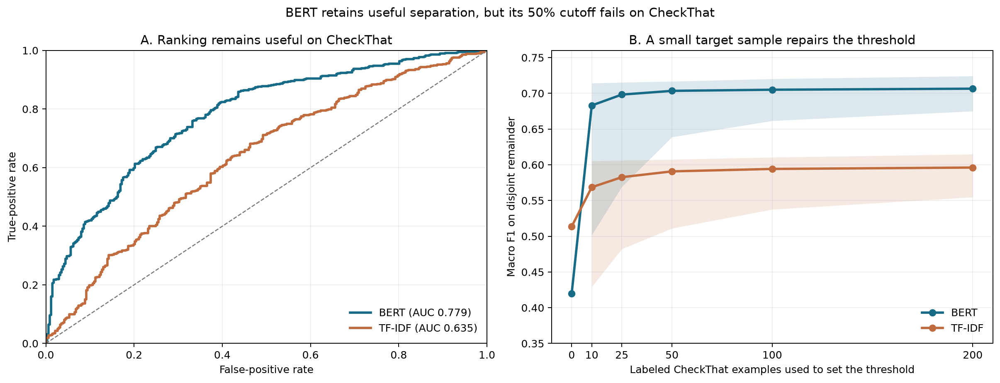
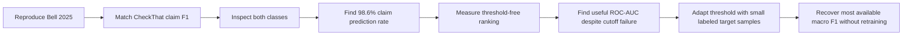
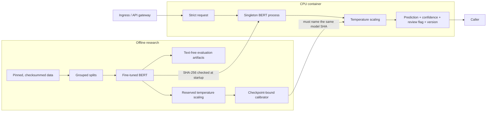

# Claim Detection Under Domain Shift

[](https://github.com/newrohansinha/claim-detector/actions/workflows/ci.yml)

This project asks one question: **when a claim detector reaches a new domain and starts labeling
almost everything as a claim, has it stopped separating the classes? Or did its decision threshold
stop transferring?** The threshold is the cutoff that turns a model score into the API's `true`
or `false` answer.

**BERT continued to rank claims above non-claims on the new dataset. Its original 50% cutoff no
longer worked. I used 25 labeled examples to choose a new cutoff. I did not add those examples to
BERT's training data or change the model. Median macro F1 rose from 0.420 to 0.698 on the other 886
examples, close to the full-data diagnostic ceiling of 0.719.**

I reached this result by reproducing the fine-tuned BERT evaluation in
[Bell (2025)](https://aclanthology.org/2025.fever-1.6/), then extending it with class-balanced and
threshold-free diagnostics. On CheckThat, BERT matches the paper's claim F1 but predicts “claim”
for 98.6% of sentences, motivating the threshold experiment above.

## Main result

BERT's CheckThat ROC-AUC is **0.779**, so the domain shift weakens class separation but does not
erase it. At the transferred 0.5 threshold, macro F1 is only **0.420**. Selecting a new threshold
from 25 labeled CheckThat examples raises median macro F1 to **0.698** on the disjoint remainder,
without changing any model weights.



*Figure 1. Left: BERT retains more ranking signal than TF-IDF on CheckThat. Right:
each threshold is selected on a small labeled target subset and evaluated on different target
records. Shading is the central 95% of 2,000 repeated stratified splits.*

| Model | Labeled target examples | Median macro F1 on disjoint remainder | Central 95% range |
|---|---:|---:|---:|
| BERT, transferred 0.5 threshold | 0 | 0.420 | N/A |
| BERT, target-selected threshold | 10 | 0.683 | 0.502–0.714 |
| BERT, target-selected threshold | 25 | **0.698** | 0.569–0.715 |
| BERT, target-selected threshold | 50 | **0.703** | 0.639–0.717 |
| BERT, target-selected threshold | 100 | **0.705** | 0.662–0.720 |
| BERT, target-selected threshold | 200 | **0.706** | 0.675–0.724 |
| TF-IDF, transferred 0.5 threshold | 0 | 0.514 | N/A |
| TF-IDF, target-selected threshold | 25 | 0.583 | 0.482–0.606 |
| TF-IDF, target-selected threshold | 100 | 0.594 | 0.538–0.610 |

The full-label oracle threshold gives BERT macro F1 **0.719**. This is an upper-bound diagnostic
because it uses all CheckThat labels for selection and evaluation. It is not deployable
performance. The disjoint-split result reaches 0.705 with 100 labels, so most of the recoverable
operating-point performance does not require retraining BERT.

BERT's representation also degrades. ROC-AUC falls from 0.971 on the mixed test to 0.779 on
CheckThat. The fixed threshold creates a second problem by understating the useful ranking signal
that remains. A labeled target sample can correct this part of the failure without retraining.

## Experiment design

The study uses saved predictions from the frozen BERT and TF-IDF models on all 911 CheckThat
examples. All resampling operates on observed labels and predictions. Model weights remain fixed.

For target-label budgets of 10, 25, 50, 100, and 200:

1. Draw a stratified labeled subset from CheckThat.
2. Choose the threshold that maximizes macro F1 on that subset.
3. Evaluate the threshold on the disjoint remaining records.
4. Use the identical split for BERT and TF-IDF.
5. Repeat 2,000 times.

The reported interval is the 2.5th–97.5th percentile across repeated adaptation samples. It shows
sensitivity to which examples are labeled. It is not a population confidence interval.

This is a **post-hoc exploratory experiment**. The question arose after the frozen CheckThat
evaluation showed a 98.6% positive prediction rate alongside nontrivial ROC-AUC. The adaptation
result answers that follow-up question. It is not preregistered or untouched-target evidence.

## How the evidence fits together



*Figure 2. The investigation moves from benchmark reproduction to failure diagnosis and then to
target-threshold adaptation.*

## Evidence behind the main question

### The reproduced F1 and two-class behavior diverge

The mixed-source BERT is close to the paper's reported result despite reserving 1,600 training
records for validation and calibration and training for three rather than five epochs.

| Evaluation and model | Accuracy | Claim F1 | Macro F1 | ROC-AUC | Predicted claim rate |
|---|---:|---:|---:|---:|---:|
| Mixed test, BERT in Bell (2025) | 0.917 | 0.911 | N/A | N/A | N/A |
| Mixed test, BERT in this work | 0.907 | 0.901 | **0.907** | **0.971** | 47.1% |
| CheckThat, BERT in Bell (2025) | 0.633 | 0.774 | N/A | N/A | N/A |
| CheckThat, BERT in this work | 0.640 | **0.777** | 0.420 | **0.779** | **98.6%** |
| CheckThat, TF-IDF | **0.650** | 0.771 | **0.514** | 0.635 | 89.9% |

BERT correctly labels 572 of 574 CheckThat claims but only **11 of 337 non-claims**. Because 63%
of CheckThat examples are claims, predicting the positive class almost everywhere preserves claim
F1. Macro F1, the confusion matrix, and prediction rate expose the failure. ROC-AUC then shows
that the underlying ranking has not collapsed to the same degree.


*Figure 3. At the fixed threshold, claim F1 remains comparable while macro F1 reveals BERT's
near-one-class behavior.*

### In-domain calibration does not fix the new domain

Temperature scaling was fit on 800 reserved composite examples (`T=1.6536`). It improves all
three average calibration measures on the mixed test, but CheckThat remains badly miscalibrated.
Temperature scaling is monotonic, so it does not change class ranking or the prediction at a 0.5
threshold.

| Evaluation | NLL, raw → scaled | Brier, raw → scaled | ECE, raw → scaled |
|---|---:|---:|---:|
| Reserved calibration | 0.2554 → **0.2135** | 0.0614 → **0.0587** | 0.0476 → **0.0378** |
| Frozen mixed test | 0.2795 → **0.2310** | 0.0759 → **0.0689** | 0.0623 → **0.0440** |
| CheckThat transfer | 2.1820 → **1.3441** | 0.3537 → **0.3366** | 0.3558 → **0.3367** |


*Figure 4. Calibration learned from the composite transfers poorly to CheckThat.*

The same problem appears in selective prediction. A confidence threshold chosen for at most 5%
error on the reserved calibration split handles 92.1% of those examples automatically at 4.9%
error. On CheckThat it handles 98.4% automatically at **35.6% error**. Many shifted examples
receive high confidence despite being wrong. That result led to the target-threshold experiment.

### Why the mixed split did not reveal the problem

The composite contains ClaimBuster, PoliClaim, and AVeriTeC. Source identity is strongly related
to both label balance and writing style:

| Diagnostic | Evaluation | Accuracy | Macro F1 |
|---|---|---:|---:|
| Predict claim label from source identity only | Frozen mixed test | 0.780 | 0.775 |
| Predict source identity from sentence text | Grouped five-fold cross-validation | 0.861 | 0.785 |
| Always predict the largest source | Same five folds | 0.614 | 0.254 |


*Figure 5. A random mixed split preserves the same source-specific label balances in training and
testing.*

As a supporting check, I trained source-held-out BERT models and matched source-included controls.
Each pair has exactly the same fit and validation sizes and label counts. Normalized-text groups
remain intact, and target test hashes are excluded. Removing target-source exposure reduces macro
F1 by 7.2 points on ClaimBuster and 9.0 points on PoliClaim.

| Target source and measure | Source included | Source absent | Change (paired 95% CI) |
|---|---:|---:|---:|
| ClaimBuster macro F1, n=1,626 | 0.7456 | 0.6737 | **−0.0719** [−0.0892, −0.0552] |
| PoliClaim macro F1, n=383 | 0.8143 | 0.7243 | **−0.0900** [−0.1297, −0.0530] |
| AVeriTeC claim recall, n=591 | 0.9797 | 0.9628 | **−0.0169** [−0.0305, −0.0034] |


*Figure 6. Controlled source-exposure differences with paired 2,000-sample bootstrap intervals.*

These source results support the main interpretation. High performance on a familiar source
mixture does not establish that the same operating point will survive a new collection process.
The matched control also corrects an initially misleading result: the naive ClaimBuster holdout
suggested a 19.7-point loss, which fell to 7.2 points after training size and class prior were
matched.

## What the result means for the API

The service detects whether a sentence asserts at least one proposition that external evidence
could prove or disprove. Truth verification is outside its scope.

| Sentence | Output | Reason |
|---|---|---|
| The moon is made of cheese. | Claim | False, but externally checkable. |
| Tomorrow it will rain in Boston. | Claim | A definite, checkable prediction. |
| Is unemployment rising? | Not claim | The sentence asks rather than asserts. |
| Taylor Swift is the greatest singer alive. | Not claim | “Greatest” has no agreed criterion here. |

The labeling rule includes false, negated, attributed, and definite future assertions when they
are externally checkable. Pure questions, commands, and subjective judgments are not claims. A
mixed sentence is a claim if it contains at least one checkable assertion.

The deployed endpoint retains the in-domain 0.5 decision threshold. I did not replace it with the
CheckThat threshold because that value is target-specific and came from a post-hoc study. A new
production domain should supply a small representative labeled sample before automatic handling
is enabled. Aggregate prediction rates should also be monitored.

## Implementation reference

### API

A fresh clone does not contain the 418 MB BERT checkpoint. Complete the commands through
`make calibrate` in [Reproduce and verify](#reproduce-and-verify) before running the API or building
the Docker image.

```bash
make serve

curl -X POST http://127.0.0.1:8000/v1/predict \
  -H 'Content-Type: application/json' \
  -d '{"sentence":"The Empire State Building is in New York City."}'
```

```json
{
  "is_claim": true,
  "confidence": 0.9817,
  "claim_probability": 0.9817,
  "review_recommended": false,
  "model_version": "ab8cd8a15cdc"
}
```

`confidence` is the calibrated probability of the returned class. `claim_probability` always
refers to the positive class. Health, readiness, model metadata, and OpenAPI endpoints are exposed
at `/health/live`, `/health/ready`, `/v1/model`, and `/docs`.

### Serving architecture



*Figure 7. The model and calibrator share an enforced artifact identity. A mismatch fails at
startup.*

Requests use strict schemas, reject unknown fields and sentences over 2,000 characters, and reject
declared bodies over 16 KiB. The model loads once, inference is serialized to avoid CPU
oversubscription, and the container runs as UID 10001 with a read-only root filesystem, no Linux
capabilities, and no privilege escalation.

TLS, authentication, global rate limits, and hard edge-level body limits belong at the ingress in
a public deployment. Production telemetry should track latency, failures, predicted claim rate,
and review rate by model version without logging sentence text.

### Real container benchmark

The approximately 687 MB image was tested through real HTTP requests against the real fine-tuned
checkpoint on Docker Desktop ARM64 CPU. Every response was contract-validated.

| Requests | Concurrency | p50 | p95 | p99 | Throughput | Failures |
|---:|---:|---:|---:|---:|---:|---:|
| 100 | 1 | 56.6 ms | 61.4 ms | 65.2 ms | 19.5 req/s | 0 |
| 500 | 4 | 176.3 ms | 187.5 ms | 198.6 ms | 22.8 req/s | 0 |

Local model execution is serialized, so queueing latency rises at concurrency four. Research
dependencies are excluded from the runtime image.

### Data and training

| Source | Usable records | Claims | Not claims | Role |
|---|---:|---:|---:|---|
| ClaimBuster | 7,976 | 1,994 | 5,982 | Composite |
| PoliClaim | 1,953 | 1,154 | 799 | Composite |
| AVeriTeC | 3,067 | 3,067 | 0 | Composite |
| CheckThat | 911 | 574 | 337 | External evaluation and exploratory target adaptation |

The pinned composite has 12,997 rows and 12,996 usable texts. Its released training portion is
divided into 8,796 fit, 800 validation, and 800 calibration records. Normalized duplicate groups
stay together across derived splits. The frozen paper test remains untouched.

The audit found 49 normalized duplicate groups and no conflicting-label duplicates. Eighteen
hashes cross the released train/test boundary, affecting 20 test records. Removing those test
records changes BERT macro F1 only from 0.9066 to 0.9058.

The model is a full fine-tune of `google-bert/bert-base-uncased` at revision
`86b5e0934494bd15c9632b12f734a8a67f723594`.

| Setting | Value |
|---|---:|
| Sequence length | 128 tokens |
| Epochs / selected mixed epoch | 3 / 2 |
| Learning rate / weight decay | 2 × 10⁻⁵ / 0.01 |
| Warmup / maximum gradient norm | 10% / 1.0 |
| Training / evaluation batch | 16 / 32 |
| Seed / selection metric | 42 / validation macro F1 |

Training ran on Apple MPS. No test-set hyperparameter search was performed. The TF-IDF baseline is
word unigram/bigram logistic regression with a 100,000-feature cap and seed 42.

## Reproduce and verify

Requirements: Python 3.11 or 3.12 and [`uv`](https://docs.astral.sh/uv/).

```bash
make setup
make prepare
make audit
make baseline
make source-probe
make train-bert
make train-bert-heldout
make train-bert-control
make calibrate
make adapt-threshold
make verify
```

Then build the self-contained CPU image with `make docker-build` and run it with `make docker-up`.

| Reproducibility anchor | Identity |
|---|---|
| Upstream data revision | `4fd0cbe0f74fb08d3caf76d77f6757fc9207ebe9` |
| Base BERT revision | `86b5e0934494bd15c9632b12f734a8a67f723594` |
| Selected model SHA-256 | `ab8cd8a15cdc0badef3d90b2b57e98b03d7435e4b36c7aafc8999a625df99224` |
| API model version | `ab8cd8a15cdc` |
| Development and adaptation seed | 42 |

Raw upstream data is not redistributed because its repository has no repository-level license
file. The approximately 418 MB model weights are excluded from Git and rebuilt locally. Generated
reports contain no sentence text.

The work was limited to a 20-hour active-work timebox. Codex accelerated implementation and
testing. Every quantitative statement in this README traces to executable code and saved
predictions from the real datasets.

`make verify` runs Ruff, strict mypy, and 58 tests. Tests cover data integrity, grouped splitting,
threshold selection and repeated adaptation, bootstrap math, calibration, the review policy, API
validation, artifact mismatch failure, real checkpoint inference when weights exist, packaging,
and pinned real-data evidence. Linux CI downloads and verifies the actual research data.

## Limitations

- The threshold-adaptation study is a post-hoc analysis on one previously evaluated external
  dataset, not confirmation on a new untouched domain.
- Repeated holdout ranges measure sensitivity to the labeled target sample. They are not
  population confidence intervals or 2,000 independent datasets.
- Stratified sampling assumes the labeled target sample is representative enough to contain both
  classes. Ten-label estimates have visibly high variance.
- The threshold optimizes macro F1, which weights both classes equally. A production decision cost
  may require a different target metric.
- Threshold adaptation cannot repair all domain shift. CheckThat ROC-AUC remains well below the
  mixed-test ROC-AUC.
- One BERT seed was trained per condition. Source-effect bootstrap intervals cover evaluation
  records, not initialization or matched-sample variance.
- Matching source controls fixes size and class prior, but restoring a source changes the
  remaining source mixture.
- AVeriTeC is positive-only in this release, so only claim recall is comparable for its source
  slice.
- The datasets use related but non-identical definitions of claim detection and check-worthiness.
- The service detects assertions. It does not retrieve evidence or determine truth.

## Key files

- [`src/claim_detector/evaluation/threshold_adaptation.py`](src/claim_detector/evaluation/threshold_adaptation.py): main experiment
- [`reports/generated/threshold_adaptation/metrics.json`](reports/generated/threshold_adaptation/metrics.json): complete results
- [`src/claim_detector/models/bert_control.py`](src/claim_detector/models/bert_control.py): matched source analysis
- [`src/claim_detector/evaluation/calibration.py`](src/claim_detector/evaluation/calibration.py): calibration analysis
- [`src/claim_detector/api/`](src/claim_detector/api/): inference service

## Reference

Andrew Bell. 2025. [*Less Can be More: An Empirical Evaluation of Small and Large Language Models
for Sentence-level Claim Detection*](https://aclanthology.org/2025.fever-1.6/). Proceedings of the
Eighth Fact Extraction and VERification Workshop (FEVER), pages 85–90. Association for
Computational Linguistics. DOI: [10.18653/v1/2025.fever-1.6](https://doi.org/10.18653/v1/2025.fever-1.6/).
