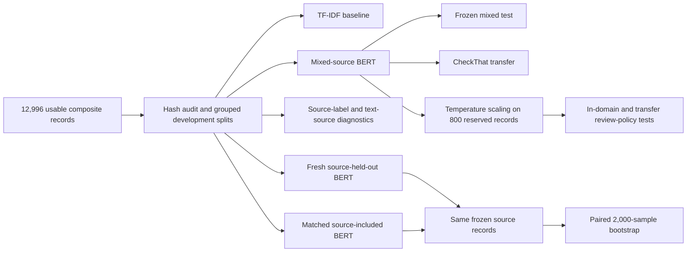
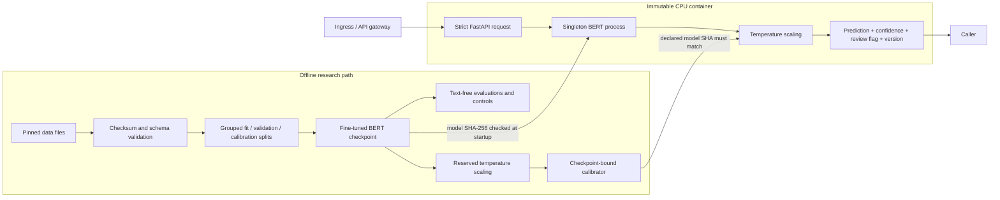

# Claim Detection Under Source Shift

[](https://github.com/newrohansinha/claim-detector/actions/workflows/ci.yml)

**A reproducible BERT study and deployable API for sentence-level factual claim detection.**

> The model reaches **0.907 macro F1** on a mixed-source test set, yet only **0.420 macro F1**
> on CheckThat tweets. After controlling for training-set size and class balance, withholding a
> source still costs **7.2–9.0 macro-F1 points** on the two binary source tests. The transfer
> problem is real; a naive holdout experiment can substantially exaggerate its size.

## Abstract

This project fine-tunes `google-bert/bert-base-uncased` to decide whether an English sentence
contains a factual claim. It follows the data released with Bell (2025), reproduces the paper's
strong in-domain and weak out-of-domain BERT results, and then asks a stricter question: **does the
model learn claim detection that transfers across dataset sources, or does a mixed test hide
source dependence?**

The investigation combines a data audit, a TF-IDF baseline, a text-only source probe, fresh
leave-one-source-out BERT training, and size/class-prior-matched source-exposure controls. The
controlled experiment finds transfer penalties whose paired confidence intervals exclude zero.
It also corrects the first, confounded estimate: ClaimBuster's apparent 19.7-point macro-F1 loss
falls to 7.2 points after matching. Temperature scaling improves in-domain confidence estimates,
but a confidence-based review policy fails under domain shift: it automatically accepts 98.4% of
CheckThat predictions while those accepted predictions have 35.6% error.

The selected checkpoint and calibrator are served through FastAPI and a hardened CPU container.
The API verifies artifact hashes at startup, returns calibrated probabilities and model identity,
and has been exercised with real HTTP load against the real fine-tuned model. No synthetic data,
mock benchmark results, or simulated model outputs are reported.

## What the system predicts

The task is **claim detection**, not fact verification. A positive result means that external
evidence could, in principle, establish whether at least one proposition in the sentence is true
or false.

| Sentence | Output | Why |
|---|---|---|
| The moon is made of cheese. | Claim | False, but externally checkable. |
| Tomorrow it will rain in Boston. | Claim | A definite prediction that will become checkable. |
| Is unemployment rising? | Not claim | A question does not itself assert the proposition. |
| Taylor Swift is the greatest singer alive. | Not claim | “Greatest” has no agreed factual criterion here. |

The complete annotation boundary, including negation, attribution, mixed sentences, and
hypotheticals, is in [`LABEL_POLICY.md`](LABEL_POLICY.md).

## What this work adds

The reference paper showed that a fine-tuned BERT performs well on its composite test and poorly
on CheckThat tweets. This project reproduces that result and extends it in five ways:

1. **Audits the benchmark before optimizing it.** Duplicate leakage, source-specific label priors,
   text lengths, invalid rows, and source recoverability are measured and retained as evidence.
2. **Reports metrics that expose failure.** Claim F1 is shown beside macro F1, class prevalence,
   prediction rate, and confusion counts. This reveals that high transfer F1 can coexist with an
   almost-all-positive classifier.
3. **Makes source transfer the main experiment.** Each source is removed from fitting and
   checkpoint selection, then evaluated on frozen, unseen records from that source.
4. **Corrects the first experiment instead of defending it.** Matched controls hold fit size,
   validation size, and label counts constant. This separates source exposure from two major
   confounders in ordinary leave-one-source-out training.
5. **Tests confidence and deployment claims end to end.** Calibration and review thresholds are
   fit on reserved data, tested under domain shift, bound to the checkpoint by SHA-256, and served
   through the same container that was load tested.

## 1. Data

### Sources and splits

The dataset is pinned to commit
[`4fd0cbe0f74fb08d3caf76d77f6757fc9207ebe9`](https://github.com/VeritaResearch/claim-extraction/tree/4fd0cbe0f74fb08d3caf76d77f6757fc9207ebe9)
of the public VeritaResearch release. Every downloaded file is SHA-256 verified.

| Source | Role | Usable records | Claims | Not claims | Claim rate |
|---|---|---:|---:|---:|---:|
| ClaimBuster | Composite | 7,976 | 1,994 | 5,982 | 25.0% |
| PoliClaim | Composite | 1,953 | 1,154 | 799 | 59.1% |
| AVeriTeC | Composite | 3,067 | 3,067 | 0 | 100.0% |
| CheckThat 2022 English | External only | 911 | 574 | 337 | 63.0% |

The upstream composite contains 12,997 rows; one AVeriTeC row has empty text, leaving **12,996
usable records**. The released 80/20 paper split is retained for direct comparison. The 10,396-row
paper training portion is divided into **8,796 fit**, **800 validation**, and **800 calibration**
records. Normalized duplicate-text groups stay together across those three development splits.
The frozen paper test contains 2,600 records and is never used for model or threshold selection.


*Figure 1. The composite is not a homogeneous sample. Source and label are strongly associated:
AVeriTeC is positive-only, while ClaimBuster is 75% negative. This is the confound addressed by
the matched-control experiment.*

### Integrity findings

The audit found 49 normalized duplicate groups covering 128 records and no duplicate groups with
conflicting labels. Eighteen normalized hashes cross the frozen paper train/test boundary,
covering 54 total records; 20 test records are affected. Those records remain in the
paper-comparable evaluation, but a second score removes them. BERT macro F1 changes only from
0.9066 to 0.9058, so overlap does not explain the main result.

The three source datasets also encode related but non-identical labeling projects: factual claim
detection, check-worthiness, and already-selected fact-checking claims. Cross-source degradation
can therefore reflect both language shift and annotation-policy shift. This work does not pretend
those causes are fully separable.

## 2. Experimental method

### Models

**TF-IDF baseline.** A logistic regression model over word unigrams and bigrams, with a 100,000
feature cap, sublinear term frequency, `C=1.0`, and seed 42. It tests how far surface lexical cues
go before using a transformer.

**BERT.** Full-parameter fine-tuning of `google-bert/bert-base-uncased`, pinned to revision
`86b5e0934494bd15c9632b12f734a8a67f723594`.

| Setting | Value |
|---|---:|
| Maximum sequence length | 128 tokens |
| Epochs | 3 |
| Learning rate | 2 × 10⁻⁵ |
| Weight decay | 0.01 |
| Warmup | 10% of optimizer steps |
| Train / evaluation batch | 16 / 32 |
| Maximum gradient norm | 1.0 |
| Random seed | 42 |
| Checkpoint selection | Validation macro F1 |
| Selected mixed-model epoch | 2 |

Training ran on Apple MPS; deployment and load testing ran on ARM64 CPU. The model was not chosen
through a test-set hyperparameter search.

### Evaluation ladder



*Figure 2. The mixed benchmark establishes ordinary task performance. The held-out/control pair is
the controlled comparison of interest; calibration and deployment use only the selected mixed model.*

The main metrics are accuracy, claim precision/recall/F1, macro F1, PR-AUC, ROC-AUC, positive
prediction rate, and confusion counts. Macro F1 matters because it weights performance on claims
and non-claims equally. Uncertainty intervals use 2,000 bootstrap resamples. Matched comparisons
use the same evaluation records and a paired bootstrap.

## 3. Results

### 3.1 Mixed-source performance is strong

| Model | Accuracy | Claim precision | Claim recall | Claim F1 | Macro F1 | Predicted claim rate |
|---|---:|---:|---:|---:|---:|---:|
| TF-IDF baseline | 0.8465 | 0.8589 | 0.8030 | 0.8300 | 0.8451 | 43.6% |
| BERT, this work | **0.9069** | 0.8963 | **0.9052** | **0.9007** | **0.9066** | 47.1% |
| BERT, Bell (2025) | 0.9170 | 0.9180 | 0.9040 | 0.9110 | — | — |

This BERT is within 1.0 accuracy point and 1.0 claim-F1 point of the paper's model while reserving
1,600 paper-training records for validation and calibration and training for three rather than
five epochs. That makes the implementation a close, but not exact, reproduction. The positive
prediction rate also tracks the mixed-test prevalence of 46.7%, and the duplicate-clean result is
essentially unchanged.

### 3.2 The published transfer F1 is reproducible—and misleading alone

| Model | Accuracy | Claim precision | Claim recall | Claim F1 | Macro F1 | Predicted claim rate |
|---|---:|---:|---:|---:|---:|---:|
| TF-IDF baseline | 0.6498 | 0.6557 | 0.9355 | 0.7710 | **0.5137** | 89.9% |
| BERT, this work | 0.6400 | 0.6370 | 0.9965 | **0.7772** | 0.4200 | **98.6%** |
| BERT, Bell (2025) | 0.6330 | 0.6320 | 0.9980 | 0.7740 | — | — |

The CheckThat result closely reproduces the paper: 0.777 claim F1 here versus 0.774 reported.
But the confusion matrix changes the interpretation. BERT correctly classifies 572 of 574 claims
and only **11 of 337 non-claims**. Because 63% of the dataset is positive, predicting “claim” for
nearly everything preserves a superficially strong positive-class F1 while macro F1 collapses.


*Figure 3. Claim F1 alone hides the external-domain failure. On CheckThat, BERT's claim F1 remains
high while macro F1 falls below the simpler TF-IDF baseline.*

### 3.3 Dataset source is a strong signal

Two diagnostics test whether the mixed benchmark contains exploitable provenance structure.

| Diagnostic | Input | Evaluation | Accuracy | Macro F1 |
|---|---|---|---:|---:|
| Source-majority label rule | Source ID only; no sentence | Frozen mixed test | 0.7804 | 0.7747 |
| Text source probe | Sentence text only | 5-fold grouped cross-validation | 0.8613 | 0.7848 |
| Text source-probe baseline | Always predict ClaimBuster | Same grouped folds | 0.6137 | 0.2535 |

The first rule predicts each source's majority claim label without reading the text and reaches
78.0% accuracy. The second predicts which dataset a sentence came from with 86.1% accuracy. These
results establish that label priors differ by source and source identity is recoverable from text.
They do **not** prove that BERT uses a particular source shortcut; that stronger causal claim is
not made.

### 3.4 Hero experiment: matched source exposure

A normal leave-one-source-out experiment changes several things at once. Removing ClaimBuster,
for example, removes the largest source and most negative examples. Comparing that smaller,
positive-heavy training set with the full mixed model confounds source exposure with sample size
and class balance.

For each target source, the corrected experiment trains two fresh BERT models:

- **Source held out:** no target-source record can enter fitting or checkpoint selection.
- **Matched source included:** target-source records are restored, but fit rows, validation rows,
  fit label counts, and validation label counts exactly match the held-out condition.

Sampling occurs over whole normalized-text groups. Any candidate whose hash appears in the target
source's frozen test records is excluded. Both models are scored on the same records; the effect is
`held-out score − source-included score`.

| Test source | Metric | Matched source included | Source held out | Controlled effect (95% CI) | Naive effect |
|---|---|---:|---:|---:|---:|
| ClaimBuster, n=1,626 | Macro F1 | 0.7456 | 0.6737 | **−0.0719** [−0.0892, −0.0552] | −0.1967 |
| PoliClaim, n=383 | Macro F1 | 0.8143 | 0.7243 | **−0.0900** [−0.1297, −0.0530] | −0.0872 |
| AVeriTeC, n=591 | Claim recall | 0.9797 | 0.9628 | **−0.0169** [−0.0305, −0.0034] | −0.0271 |


*Figure 4. Point estimates and paired 95% bootstrap intervals. Every interval is below zero, so
source absence still hurts after matching training size and label counts.*

The result is more useful than the naive story:

- **ClaimBuster:** the raw 19.7-point drop was heavily exaggerated; the controlled penalty is 7.2
  points. Most of the apparent effect was not source absence alone.
- **PoliClaim:** the result survives almost unchanged, from an 8.7-point naive drop to a 9.0-point
  controlled drop. This is the strongest evidence of a genuine source-exposure effect.
- **AVeriTeC:** the effect is smaller but non-zero. Because its test slice contains only claims,
  claim recall is the only defensible class-performance measure; macro F1 would be misleading.

This matched analysis was added after the initial holdout exposed the confound. That chronology is
reported rather than presented as preregistration. The sampling rule, exclusions, seed, and code
were committed before the matched models were trained.

### 3.5 Calibration helps in-domain, not enough under shift

Temperature scaling fits one scalar temperature, **1.6536**, on the untouched 800-record
calibration split. It rescales logits without changing the predicted class.

| Evaluation | NLL, raw → scaled | Brier, raw → scaled | ECE, raw → scaled |
|---|---:|---:|---:|
| Reserved calibration | 0.2554 → **0.2135** | 0.0614 → **0.0587** | 0.0476 → **0.0378** |
| Frozen mixed test | 0.2795 → **0.2310** | 0.0759 → **0.0689** | 0.0623 → **0.0440** |
| CheckThat transfer | 2.1820 → **1.3441** | 0.3537 → **0.3366** | 0.3558 → **0.3367** |


*Figure 5. Temperature scaling improves average calibration measures in-domain. CheckThat remains
far from the diagonal; sparse equal-width bins are shown only when populated.*

Even on CheckThat the average calibration metrics improve numerically, but they remain an order of
magnitude worse than in-domain values, and maximum calibration error worsens from 0.778 to 0.811.
Calibration on one distribution does not solve unknown-domain confidence.

The calibration split also selects a confidence threshold of **0.7758** for at most 5% empirical
error among automatically accepted predictions:

| Evaluation | Automatic coverage | Error among automatic predictions | Interpretation |
|---|---:|---:|---|
| Reserved calibration | 92.1% | 4.9% | Threshold-fitting result |
| Frozen mixed test | 91.0% | 5.8% | Similar in-domain behavior |
| CheckThat transfer | 98.4% | 35.6% | Confidently wrong under shift |

This negative finding directly shapes the API. It exposes `review_recommended` because the policy
is useful in-domain, but the field is documented as a triage hint—not an OOD detector or safety
guarantee.

## 4. Deployed system

### API contract

```bash
make serve

curl -X POST http://127.0.0.1:8000/v1/predict \
  -H 'Content-Type: application/json' \
  -d '{"sentence":"The Empire State Building is in New York City."}'
```

```json
{
  "is_claim": true,
  "confidence": 0.9817,
  "claim_probability": 0.9817,
  "review_recommended": false,
  "model_version": "ab8cd8a15cdc"
}
```

`confidence` is the calibrated probability of the returned class;
`claim_probability` is always the calibrated probability of the positive class. The service also
provides `/health/live`, `/health/ready`, `/v1/model`, and generated OpenAPI docs at `/docs`.

### Architecture and artifact boundary



*Figure 6. Research artifacts and serving artifacts share one identity boundary. A calibrator
cannot silently be paired with a different model.*

Serving safeguards are concrete rather than aspirational:

- the BERT checkpoint loads once at process startup;
- the calibrator names the exact `model.safetensors` SHA-256, and startup fails on mismatch;
- strict Pydantic schemas reject unknown fields, non-string input, blank text, and sentences over
  2,000 characters;
- declared request bodies over 16 KiB are rejected, while hard global body limits remain an
  ingress responsibility;
- responses disable caching and MIME sniffing and include request IDs;
- local inference is serialized to avoid CPU oversubscription and unbounded memory growth;
- the container runs as UID 10001 with a read-only root filesystem, no Linux capabilities, and
  `no-new-privileges`;
- research-only packages such as pandas and matplotlib are excluded from the runtime image.

For a public service, TLS, authentication, global rate limiting, and edge-level body enforcement
belong at the ingress. Horizontal scale should use one model process per replica; adding arbitrary
web workers duplicates the approximately 418 MB checkpoint in memory.

### Real container benchmark

The self-contained image was built with the fine-tuned checkpoint, reported at approximately
687 MB, and tested through real HTTP calls on Docker Desktop ARM64 CPU. Every response was checked
against the API contract.

| Requests | Concurrency | p50 | p95 | p99 | Throughput | Failures |
|---:|---:|---:|---:|---:|---:|---:|
| 100 | 1 | 56.6 ms | 61.4 ms | 65.2 ms | 19.5 req/s | 0 |
| 500 | 4 | 176.3 ms | 187.5 ms | 198.6 ms | 22.8 req/s | 0 |

Concurrency raises queueing latency because inference is deliberately serialized. That tradeoff
is visible in the numbers instead of hidden behind a mock load test.

Production telemetry should count requests, latency, failures, claim rate, and review rate by
model version **without logging sentence text**. Alerts should cover error/latency budgets and
sudden changes in prediction or review rates.

## 5. Reproducibility

Requirements: Python 3.11 or 3.12 and [`uv`](https://docs.astral.sh/uv/). Docker is optional for
serving.

```bash
make setup
make prepare
make audit
make baseline
make source-probe
make train-bert
make train-bert-heldout
make train-bert-control
make calibrate
make verify
```

After `make train-bert`, build and run the CPU image:

```bash
make docker-build
make docker-up
```

Reproducibility anchors:

| Artifact | Identity |
|---|---|
| Upstream dataset revision | `4fd0cbe0f74fb08d3caf76d77f6757fc9207ebe9` |
| Base BERT revision | `86b5e0934494bd15c9632b12f734a8a67f723594` |
| Selected model SHA-256 | `ab8cd8a15cdc0badef3d90b2b57e98b03d7435e4b36c7aafc8999a625df99224` |
| API model version | `ab8cd8a15cdc` |
| Development / control seed | 42 |

Raw third-party data is not redistributed because the upstream repository has no
repository-level license file. The approximately 418 MB trained weights are also not committed to
Git; the commands above rebuild them, and Docker copies the local real artifact into the image.
Generated reports contain no sentence text.

`make verify` runs Ruff, strict mypy, and 53 tests. The suite covers data integrity, grouped split
behavior, bootstrap math, calibration, review policy, API validation, artifact mismatch failure,
real checkpoint inference when the artifact exists, packaging, and the actual pinned data. CI
reacquires and validates the real upstream data on Linux rather than replacing it with fixtures.

## 6. Limitations

- **One training seed per condition.** Paired bootstrap intervals capture uncertainty across
  evaluation records, not variation from initialization or alternative matched samples.
- **The control is not perfect domain surgery.** It matches size and class prior; restoring the
  target source necessarily changes the remaining source mixture.
- **Only one external domain is tested.** CheckThat demonstrates a failure mode, not a universal
  estimate of open-world performance.
- **AVeriTeC is positive-only here.** Its source evaluation supports recall, not ordinary binary
  precision, F1, or calibration claims.
- **Labels are inherited.** The source datasets operationalize claim detection and check-worthiness
  differently, so transfer loss cannot be attributed solely to writing style.
- **The paper comparison is close, not exact.** This run uses three epochs and reserves validation
  and calibration data; the paper reports five epochs.
- **Confidence is distribution-dependent.** Temperature scaling and `review_recommended` do not
  detect arbitrary domain shift.
- **This is not fact verification.** The service detects the presence of an assertion; it does not
  retrieve evidence or determine truth.

## 7. Repository guide

- [`docs/EXPERIMENT_PROTOCOL.md`](docs/EXPERIMENT_PROTOCOL.md) — hypotheses, evaluation rules, and
  interpretation constraints
- [`DATA_CARD.md`](DATA_CARD.md) — composition, integrity findings, provenance, and redistribution
- [`LABEL_POLICY.md`](LABEL_POLICY.md) — operational label boundary and hard cases
- [`TIMEBOX.md`](TIMEBOX.md) — 20-hour scope and work log
- [`AI_USAGE.md`](AI_USAGE.md) — tool-use disclosure and verification standard
- [`src/claim_detector/models/bert_control.py`](src/claim_detector/models/bert_control.py) — matched
  sampling, training, paired comparison, and Figure 4
- [`src/claim_detector/evaluation/calibration.py`](src/claim_detector/evaluation/calibration.py) —
  temperature scaling, reliability metrics, and review policy
- [`src/claim_detector/api/`](src/claim_detector/api/) — request contract and inference service
- [`reports/generated/`](reports/generated/) — machine-readable metrics, figures, hashes, and HTTP
  benchmark evidence

## Reference

Andrew Bell. 2025. [*Less Can be More: An Empirical Evaluation of Small and Large Language Models
for Sentence-level Claim Detection*](https://aclanthology.org/2025.fever-1.6/). Proceedings of the
Eighth Fact Extraction and VERification Workshop (FEVER), pages 85–90. Association for
Computational Linguistics. DOI: [10.18653/v1/2025.fever-1.6](https://doi.org/10.18653/v1/2025.fever-1.6).
