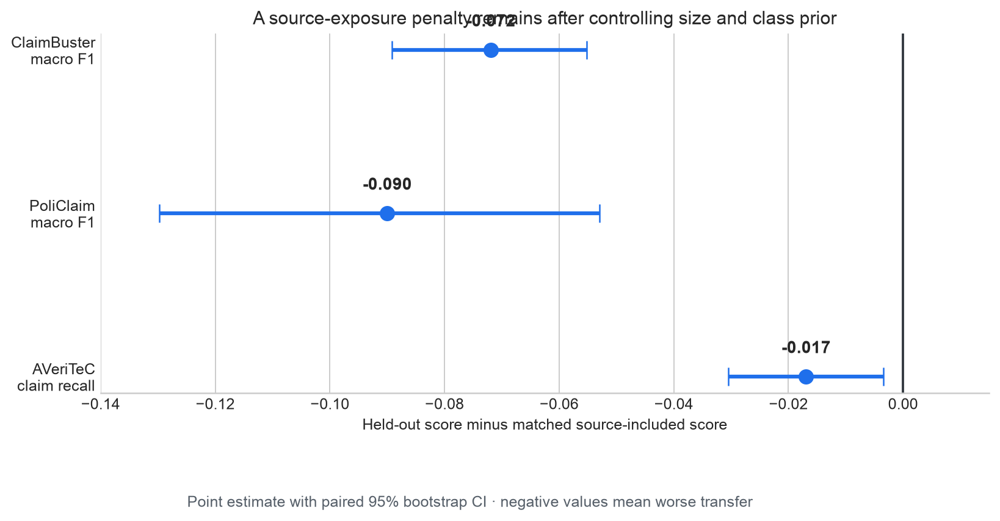
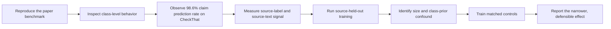
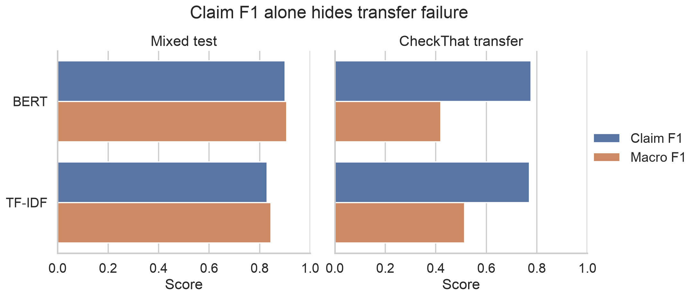
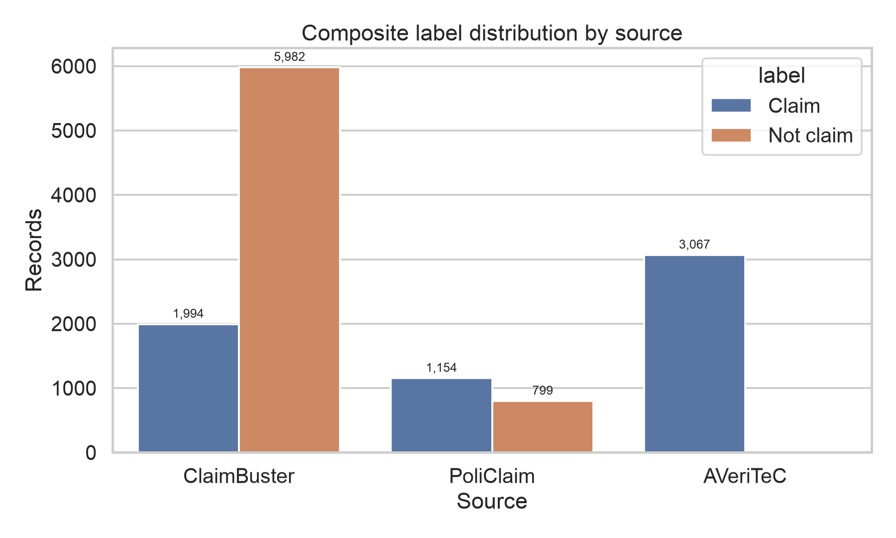
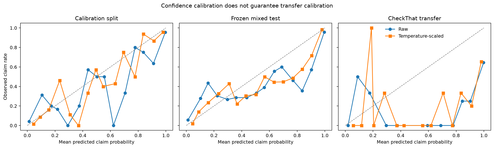
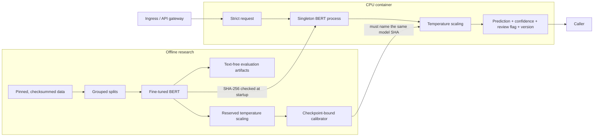

# Claim Detection Under Source Shift

[](https://github.com/newrohansinha/claim-detector/actions/workflows/ci.yml)

## Main finding: source exposure matters after matching

After matching training-set size and class balance, withholding ClaimBuster or PoliClaim reduced
macro F1 by **7.2 and 9.0 points**, with paired 95% confidence intervals entirely below zero. The
same BERT model reached **0.907 macro F1** on a mixed-source test, showing that the aggregate score
did not capture this source dependence. The matched design also showed that the initial
ClaimBuster holdout had overestimated the effect as 19.7 points because removing the source
changed training-set size and class balance at the same time.

This project studies sentence-level factual claim detection. Given one English sentence, the API
returns whether it contains a factual assertion and a calibrated confidence score; it does not
determine whether the assertion is true. The training data combines ClaimBuster, PoliClaim, and
AVeriTeC, while 911 CheckThat English tweets are reserved for external-domain evaluation.

The transfer investigation began when the model reproduced the reference paper's positive-class
F1 on CheckThat while classifying **98.6% of tweets as claims**. That result suggested that a
random mixed-source split was not sufficient evidence of generalization.

### Initial source-held-out experiment

For each source, a new BERT model was trained with that source completely absent from fitting and
checkpoint selection. Its predictions were compared with the mixed-source BERT on the same frozen
records from the target source.

| Test source | Metric | Mixed model, source included | Source-held-out model | Change |
|---|---|---:|---:|---:|
| ClaimBuster | Macro F1 | 0.8704 | 0.6737 | **−0.1967** |
| PoliClaim | Macro F1 | 0.8115 | 0.7243 | **−0.0872** |
| AVeriTeC | Claim recall | 0.9898 | 0.9628 | **−0.0271** |

The result suggested a large transfer penalty, particularly the 19.7-point ClaimBuster drop.
However, source exposure was not the only variable that changed.

Removing a source changed three things at once: source exposure, training-set size, and class
balance. ClaimBuster is both the largest source and 75% negative, while AVeriTeC is positive-only.
The initial experiment therefore did not isolate how much of the change came from source exposure.

### Controlled source-exposure experiment

A matched control was trained for every source-held-out model. Each pair had:

- exactly the same fit and validation row counts;
- exactly the same fit and validation label counts;
- whole duplicate-text groups kept together; and
- the target source restored only in the control, with frozen-test text excluded from both.

Both models were scored on the same records. The effect below is
`source held-out − matched source-included`; intervals come from a paired 2,000-sample bootstrap.

| Test source | Metric | Matched source included | Source held out | Controlled effect (95% CI) | Original effect |
|---|---|---:|---:|---:|---:|
| ClaimBuster, n=1,626 | Macro F1 | 0.7456 | 0.6737 | **−0.0719** [−0.0892, −0.0552] | −0.1967 |
| PoliClaim, n=383 | Macro F1 | 0.8143 | 0.7243 | **−0.0900** [−0.1297, −0.0530] | −0.0872 |
| AVeriTeC, n=591 | Claim recall | 0.9797 | 0.9628 | **−0.0169** [−0.0305, −0.0034] | −0.0271 |



*Figure 1. Every paired interval is below zero: performance is lower without source exposure even
after matching training size and label counts.*

The controlled results support a narrower conclusion:

- **The transfer problem is real.** Both binary source tests lose 7.2–9.0 macro-F1 points when
  their source is absent.
- **The initial ClaimBuster result overestimated the source effect.** Matching reduces the penalty
  from 19.7 points to 7.2.
- **The PoliClaim estimate remains stable.** Its penalty changes only from 8.7 to 9.0 points.
- **AVeriTeC shows a smaller recall loss.** It is positive-only, so recall is the only defensible
  class-performance metric for that slice.

The controlled evaluation is the project's main contribution. It extends the benchmark
reproduction into an analysis of source transfer, identifies a confound in the initial holdout
design, and replaces that comparison with a size- and class-prior-matched experiment.

The matched control was added after the initial holdout result exposed the confound, so it is
reported as a follow-up analysis rather than a preregistered experiment. Its sampling rule,
exclusions, seed, and code were committed before the control models were trained.

## How the investigation developed



*Figure 2. Each follow-up experiment addresses a limitation or question identified in the
preceding result.*

## Supporting evidence

### 1. Benchmark reproduction and failure analysis

The mixed-source model closely reproduces Bell (2025), despite reserving 1,600 paper-training
records for validation and calibration and training for three rather than five epochs.

| Mixed test model | Accuracy | Claim precision | Claim recall | Claim F1 | Macro F1 | Predicted claim rate |
|---|---:|---:|---:|---:|---:|---:|
| TF-IDF baseline | 0.8465 | 0.8589 | 0.8030 | 0.8300 | 0.8451 | 43.6% |
| BERT, this work | **0.9069** | 0.8963 | **0.9052** | **0.9007** | **0.9066** | 47.1% |
| BERT, Bell (2025) | 0.9170 | 0.9180 | 0.9040 | 0.9110 | — | — |

On CheckThat, this model reproduces the paper's high positive-class F1 almost exactly: 0.777 here
versus 0.774 reported. Macro F1 tells a very different story.

| CheckThat model | Accuracy | Claim precision | Claim recall | Claim F1 | Macro F1 | Predicted claim rate |
|---|---:|---:|---:|---:|---:|---:|
| TF-IDF baseline | 0.6498 | 0.6557 | 0.9355 | 0.7710 | **0.5137** | 89.9% |
| BERT, this work | 0.6400 | 0.6370 | 0.9965 | **0.7772** | 0.4200 | **98.6%** |
| BERT, Bell (2025) | 0.6330 | 0.6320 | 0.9980 | 0.7740 | — | — |

BERT correctly classifies 572 of 574 claims but only **11 of 337 non-claims**. Because CheckThat
is 63% positive, predicting “claim” almost everywhere preserves claim F1 while failing the
negative class. This is why the project reports macro F1, prediction rate, prevalence, and
confusion counts rather than a single favorable metric.



*Figure 3. Claim F1 alone hides the external-domain failure. On CheckThat, BERT's macro F1 falls
below the simpler TF-IDF baseline.*

### 2. Source structure in the mixed dataset

Two diagnostics were used to characterize source signal in the dataset before interpreting the
BERT transfer results.



*Figure 4. Source and label are strongly associated. A random mixed split lets every source—and
its characteristic label balance—appear on both sides.*

| Diagnostic | What it sees | Evaluation | Accuracy | Macro F1 |
|---|---|---|---:|---:|
| Source-majority label rule | Source ID only; no text | Frozen mixed test | 0.7804 | 0.7747 |
| Text source probe | Sentence text only | 5-fold grouped CV | 0.8613 | 0.7848 |
| Source-probe baseline | Always predicts ClaimBuster | Same folds | 0.6137 | 0.2535 |

A rule that sees only source identity predicts claim labels with 78.0% accuracy. Separately, a
text classifier identifies which dataset a sentence came from with 86.1% accuracy. Together these
show that source is associated with labels and recoverable from language.

They do **not** prove that BERT uses one specific source shortcut. Their role is to justify the
controlled transfer experiment, not to overstate its mechanism.

### 3. Calibration under domain shift

Temperature scaling was fit only on the reserved 800-record calibration split. It learns one
scalar temperature, **1.6536**, and changes confidence without changing predicted classes.

| Evaluation | NLL, raw → scaled | Brier, raw → scaled | ECE, raw → scaled |
|---|---:|---:|---:|
| Reserved calibration | 0.2554 → **0.2135** | 0.0614 → **0.0587** | 0.0476 → **0.0378** |
| Frozen mixed test | 0.2795 → **0.2310** | 0.0759 → **0.0689** | 0.0623 → **0.0440** |
| CheckThat transfer | 2.1820 → **1.3441** | 0.3537 → **0.3366** | 0.3558 → **0.3367** |



*Figure 5. Average calibration improves in-domain. CheckThat remains far from the diagonal even
after scaling; sparse equal-width bins appear only when populated.*

The average CheckThat metrics improve numerically but remain far worse than in-domain, and maximum
calibration error worsens from 0.778 to 0.811.

The calibration set also selects confidence 0.7758 as the threshold for at most 5% empirical error
among automatic predictions:

| Evaluation | Automatic coverage | Error among automatic predictions |
|---|---:|---:|
| Reserved calibration | 92.1% | 4.9% |
| Frozen mixed test | 91.0% | 5.8% |
| CheckThat transfer | 98.4% | **35.6%** |

The policy works similarly on in-domain test data and fails badly under shift. Low confidence is
therefore not an OOD detector. The API returns `review_recommended`, but documents it as an
in-domain triage hint—not a safety guarantee.

## What the service does

The endpoint detects whether a sentence asserts at least one proposition that external evidence
could prove or disprove. It does **not** decide whether that proposition is true.

| Sentence | Output | Reason |
|---|---|---|
| The moon is made of cheese. | Claim | False, but externally checkable. |
| Tomorrow it will rain in Boston. | Claim | A definite, checkable prediction. |
| Is unemployment rising? | Not claim | A question does not assert the proposition. |
| Taylor Swift is the greatest singer alive. | Not claim | “Greatest” has no agreed criterion here. |

See [`LABEL_POLICY.md`](LABEL_POLICY.md) for negation, attribution, mixed sentences, and hard cases.

## Implementation reference

### Data and training

The project uses the composite released with Bell (2025): ClaimBuster, PoliClaim, and AVeriTeC,
plus CheckThat English tweets as external-only evaluation data.

| Source | Usable records | Claims | Not claims | Role |
|---|---:|---:|---:|---|
| ClaimBuster | 7,976 | 1,994 | 5,982 | Composite |
| PoliClaim | 1,953 | 1,154 | 799 | Composite |
| AVeriTeC | 3,067 | 3,067 | 0 | Composite |
| CheckThat | 911 | 574 | 337 | External test only |

The pinned composite has 12,997 rows and 12,996 usable texts. Its released training portion is
divided into 8,796 fit, 800 validation, and 800 calibration records. Normalized duplicate groups
stay together across these derived splits. The frozen paper test remains untouched.

The audit found 49 normalized duplicate groups and no conflicting-label duplicates. Eighteen
hashes cross the released train/test boundary, affecting 20 test records. Removing those test
records changes BERT macro F1 only from 0.9066 to 0.9058.

The model is a full fine-tune of `google-bert/bert-base-uncased` at exact revision
`86b5e0934494bd15c9632b12f734a8a67f723594`.

| Setting | Value |
|---|---:|
| Sequence length | 128 tokens |
| Epochs / selected mixed epoch | 3 / 2 |
| Learning rate / weight decay | 2 × 10⁻⁵ / 0.01 |
| Warmup / max gradient norm | 10% / 1.0 |
| Train / evaluation batch | 16 / 32 |
| Seed / selection metric | 42 / validation macro F1 |

Training ran on Apple MPS. No test-set hyperparameter search was performed. The TF-IDF baseline is
word unigram/bigram logistic regression with a 100,000-feature cap and seed 42.

### API

```bash
make serve

curl -X POST http://127.0.0.1:8000/v1/predict \
  -H 'Content-Type: application/json' \
  -d '{"sentence":"The Empire State Building is in New York City."}'
```

```json
{
  "is_claim": true,
  "confidence": 0.9817,
  "claim_probability": 0.9817,
  "review_recommended": false,
  "model_version": "ab8cd8a15cdc"
}
```

`confidence` is the calibrated probability of the returned class. `claim_probability` always
refers to the positive class. Health, readiness, model metadata, and OpenAPI endpoints are exposed
at `/health/live`, `/health/ready`, `/v1/model`, and `/docs`.

### Serving architecture



*Figure 6. The calibrator and model share an enforced artifact identity; a mismatched pair fails
at startup.*

Requests use strict schemas, reject unknown fields and sentences over 2,000 characters, and reject
declared bodies over 16 KiB. The model loads once. Inference is serialized to avoid CPU
oversubscription. The container runs as UID 10001 with a read-only root filesystem, no Linux
capabilities, and no privilege escalation. Research-only dependencies are excluded from the
runtime image.

TLS, authentication, global rate limits, and hard edge-level body limits belong at the ingress in
a public deployment. Production telemetry should measure latency, failures, claim rate, and review
rate by model version without logging sentence text.

### Real container benchmark

The approximately 687 MB image was tested through real HTTP requests against the real fine-tuned
checkpoint on Docker Desktop ARM64 CPU. Every response was contract-validated.

| Requests | Concurrency | p50 | p95 | p99 | Throughput | Failures |
|---:|---:|---:|---:|---:|---:|---:|
| 100 | 1 | 56.6 ms | 61.4 ms | 65.2 ms | 19.5 req/s | 0 |
| 500 | 4 | 176.3 ms | 187.5 ms | 198.6 ms | 22.8 req/s | 0 |

Queueing latency rises at concurrency four because local model execution is deliberately
serialized.

## Reproduce and verify

Requirements: Python 3.11 or 3.12 and [`uv`](https://docs.astral.sh/uv/).

```bash
make setup
make prepare
make audit
make baseline
make source-probe
make train-bert
make train-bert-heldout
make train-bert-control
make calibrate
make verify
```

Then build the self-contained CPU image with `make docker-build` and run it with `make docker-up`.

| Reproducibility anchor | Identity |
|---|---|
| Upstream data revision | `4fd0cbe0f74fb08d3caf76d77f6757fc9207ebe9` |
| Base BERT revision | `86b5e0934494bd15c9632b12f734a8a67f723594` |
| Selected model SHA-256 | `ab8cd8a15cdc0badef3d90b2b57e98b03d7435e4b36c7aafc8999a625df99224` |
| API model version | `ab8cd8a15cdc` |
| Development and control seed | 42 |

Raw upstream data is not redistributed because its repository has no repository-level license
file. The approximately 418 MB weights are rebuilt locally rather than committed to Git. Generated
reports contain no sentence text.

`make verify` runs Ruff, strict mypy, and 53 tests. Tests cover data integrity, grouped splitting,
bootstrap math, calibration, the review policy, API validation, artifact mismatch failure, real
checkpoint inference when weights exist, packaging, and the pinned real data. Linux CI downloads
and verifies that real data rather than replacing reported evidence with fixtures.

## Limitations

- One seed was trained per condition. Paired intervals cover evaluation-record uncertainty, not
  initialization or matched-sample variance.
- Matching controls size and class prior, but restoring a source necessarily changes the remaining
  source mixture.
- CheckThat is one external domain, not an estimate of all open-world behavior.
- AVeriTeC is positive-only in this dataset, so only claim recall is comparable for its source
  slice.
- Source datasets use related but non-identical definitions of claim detection and
  check-worthiness. Transfer loss can reflect both language and annotation-policy shift.
- This run is a close reproduction, not an exact one: three epochs and reserved calibration data
  are used, while the paper reports five epochs.
- Temperature scaling and the review flag are distribution-dependent, not OOD safeguards.
- The service detects assertions; it does not retrieve evidence or determine truth.

## Evidence and project map

- [`docs/EXPERIMENT_PROTOCOL.md`](docs/EXPERIMENT_PROTOCOL.md) — hypotheses and evaluation rules
- [`DATA_CARD.md`](DATA_CARD.md) — provenance, composition, integrity, and redistribution
- [`LABEL_POLICY.md`](LABEL_POLICY.md) — the annotation boundary
- [`TIMEBOX.md`](TIMEBOX.md) — 20-hour scope and work log
- [`AI_USAGE.md`](AI_USAGE.md) — Codex disclosure and verification standard
- [`src/claim_detector/models/bert_control.py`](src/claim_detector/models/bert_control.py) — matched
  sampling, training, paired comparison, and Figure 1
- [`src/claim_detector/evaluation/calibration.py`](src/claim_detector/evaluation/calibration.py) —
  temperature scaling and selective prediction
- [`src/claim_detector/api/`](src/claim_detector/api/) — API contract and inference runtime
- [`reports/generated/`](reports/generated/) — metrics, figures, artifact hashes, and HTTP results

## Reference

Andrew Bell. 2025. [*Less Can be More: An Empirical Evaluation of Small and Large Language Models
for Sentence-level Claim Detection*](https://aclanthology.org/2025.fever-1.6/). Proceedings of the
Eighth Fact Extraction and VERification Workshop (FEVER), pages 85–90. Association for
Computational Linguistics. DOI: [10.18653/v1/2025.fever-1.6](https://doi.org/10.18653/v1/2025.fever-1.6).
