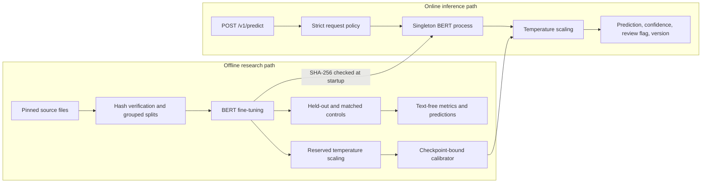

# Claim Detector

[](https://github.com/newrohansinha/claim-detector/actions/workflows/ci.yml)

A fine-tuned BERT API that decides whether one English sentence contains a factual claim. It does
not decide whether the claim is true. “The moon is made of cheese” is false, but it is still a
claim because evidence could prove or disprove it.

## Main result

A random mixed-source test can overstate how well a claim detector transfers. The main experiment
trains a fresh model with each dataset source absent, then compares it with a control that has:

- exactly the same training and validation row counts;
- exactly the same label counts;
- duplicate text groups kept together;
- the target source restored; and
- any text matching the target's frozen test set removed.

Both models are scored on the same frozen records. The interval is a paired 2,000-sample bootstrap.
The control was added after the original holdout exposed the confound; its exact sampling and
evaluation code was committed before the control models were trained.

| Test source | Metric | Matched source included | Source held out | Controlled change (95% CI) | Uncontrolled change |
|---|---|---:|---:|---:|---:|
| ClaimBuster | Macro F1 | 0.7456 | 0.6737 | -0.0719 [-0.0892, -0.0552] | -0.1967 |
| PoliClaim | Macro F1 | 0.8143 | 0.7243 | -0.0900 [-0.1297, -0.0530] | -0.0872 |
| AVeriTeC | Claim recall | 0.9797 | 0.9628 | -0.0169 [-0.0305, -0.0034] | -0.0271 |

All controlled intervals exclude zero. Source exposure still matters, but the first ClaimBuster
comparison blamed too much on source absence: its 19.7-point raw drop was heavily confounded by
removing a large, mostly-negative dataset and therefore changing both sample size and class
balance. The PoliClaim result survives the control almost unchanged. AVeriTeC is positive-only, so
recall is the only defensible class metric there.

This is the project's central finding: the transfer failure is real, but its size is
source-dependent and a naive holdout design can exaggerate it.

The intervals describe evaluation-record uncertainty. They do not include variation from training
seeds or alternative matched samples; the 20-hour scope permits one fixed seed per condition.

## Model checks

| Evaluation | Model | Accuracy | Claim F1 | Macro F1 | Predicted claim rate |
|---|---|---:|---:|---:|---:|
| Mixed paper test | TF-IDF | 0.8465 | 0.8300 | 0.8451 | 0.4362 |
| Mixed paper test | BERT | 0.9069 | 0.9007 | 0.9066 | 0.4712 |
| Mixed test without train duplicates | BERT | 0.9062 | 0.8993 | 0.9058 | 0.4678 |
| CheckThat tweets | TF-IDF | 0.6498 | 0.7710 | 0.5137 | 0.8990 |
| CheckThat tweets | BERT | 0.6400 | 0.7772 | 0.4200 | 0.9857 |

BERT is close to the paper's mixed benchmark despite reserving 1,600 training rows for validation
and calibration. On CheckThat it reproduces the paper's high claim F1, but macro F1 reveals the
failure: the model calls 98.6% of tweets claims.

A source-only diagnostic gets 0.7804 accuracy without reading the sentence, while a grouped text
probe predicts source with 0.8613 accuracy. These explain why a mixed split deserves scrutiny; the
matched experiment above measures the transfer gap.

## Confidence is calibrated, not trusted blindly

Temperature scaling is fit once on the untouched 800-row calibration split. It changes confidence,
not the predicted class.

| Evaluation | Raw NLL | Calibrated NLL | Raw ECE | Calibrated ECE |
|---|---:|---:|---:|---:|
| Reserved calibration | 0.2554 | 0.2135 | 0.0476 | 0.0378 |
| Frozen mixed test | 0.2795 | 0.2310 | 0.0623 | 0.0440 |
| CheckThat transfer | 2.1820 | 1.3441 | 0.3558 | 0.3367 |

The calibration split selects a confidence threshold of 0.7758 for at most 5% empirical error.

| Evaluation | Automatic coverage | Error among automatic predictions |
|---|---:|---:|
| Reserved calibration | 92.1% | 4.9% |
| Frozen mixed test | 91.0% | 5.8% |
| CheckThat transfer | 98.4% | 35.6% |

The last row is intentional. Under domain shift the model is confidently wrong, so uncertainty
thresholding does not act as an out-of-distribution detector. The API exposes `review_recommended`,
but clients must not treat it as a safety guarantee on unknown domains.

## API

```bash
make serve

curl -X POST http://127.0.0.1:8000/v1/predict \
  -H 'Content-Type: application/json' \
  -d '{"sentence":"The Empire State Building is in New York City."}'
```

```json
{
  "is_claim": true,
  "confidence": 0.9817,
  "claim_probability": 0.9817,
  "review_recommended": false,
  "model_version": "ab8cd8a15cdc"
}
```

`confidence` is the calibrated probability of the returned class. The service also provides
`/health/live`, `/health/ready`, `/v1/model`, and generated OpenAPI documentation at `/docs`.
Requests are strict, reject unknown fields, strip surrounding whitespace, cap sentences at 2,000
characters, and reject declared bodies over 16 KiB.

## Architecture



The model loads once during application startup. The calibrator names the exact checkpoint SHA-256;
startup fails if the two artifacts do not match. Inference is serialized inside one process to
avoid CPU oversubscription and unbounded memory growth. The container runs as UID 10001 with no
Linux capabilities, no privilege escalation, and a read-only root filesystem.

For a public deployment, TLS, authentication, global rate limits, and request-body enforcement
belong at the ingress or API gateway. Horizontal scaling should add one model process per replica;
blindly adding web workers duplicates the roughly 418 MB checkpoint in memory.

Production telemetry should count requests, latency, failures, prediction rate, and review rate by
model version without logging sentence text. Alerts should cover error/latency budgets and sudden
shifts in prediction or review rates.

## Reproduce

Requirements: Python 3.12 and `uv`.

```bash
make setup
make prepare
make audit
make baseline
make train-bert
make train-bert-heldout
make train-bert-control
make calibrate
make verify
```

The upstream data revision and BERT base revision are pinned. Downloads are SHA-256 verified. Raw
third-party data and trained weights are not committed; the commands above rebuild them. Generated
reports contain no sentence text.

After `make train-bert`, build and run the self-contained CPU image:

```bash
make docker-build
make docker-up
```

The image and Compose runtime were exercised with the real fine-tuned checkpoint. End-to-end
results on Docker Desktop ARM64 CPU:

| Requests | Concurrency | p50 | p95 | Throughput | Failures |
|---:|---:|---:|---:|---:|---:|
| 100 | 1 | 56.6 ms | 61.4 ms | 19.5 req/s | 0 |
| 500 | 4 | 176.3 ms | 187.5 ms | 22.8 req/s | 0 |

Concurrency raises queueing latency because model execution is deliberately serialized. The
benchmark measures real HTTP calls to the container and validates every response contract.

## Evidence

- [`docs/EXPERIMENT_PROTOCOL.md`](docs/EXPERIMENT_PROTOCOL.md): hypotheses and evaluation rules
- [`LABEL_POLICY.md`](LABEL_POLICY.md): annotation boundary for factual claims
- [`DATA_CARD.md`](DATA_CARD.md): data composition, licensing, and integrity findings
- [`reports/generated/bert_matched_control/metrics.json`](reports/generated/bert_matched_control/metrics.json): matched-control runs, artifact hashes, and paired intervals
- [`reports/generated/bert_calibration/metrics.json`](reports/generated/bert_calibration/metrics.json): calibration and review-policy transfer
- [`reports/generated/bert_mixed/metrics.json`](reports/generated/bert_mixed/metrics.json): mixed BERT training and evaluation
- [`reports/generated/bert_heldout/metrics.json`](reports/generated/bert_heldout/metrics.json): original source-held-out runs
- [`reports/generated/data_audit/data_audit.md`](reports/generated/data_audit/data_audit.md): measured data audit
- [`reports/generated/api_benchmark_c4.json`](reports/generated/api_benchmark_c4.json): container load measurement
